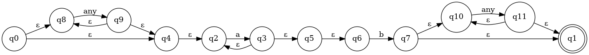
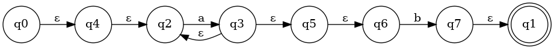
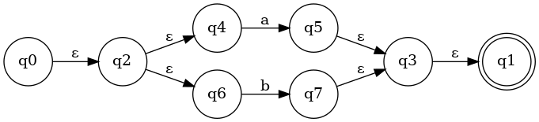
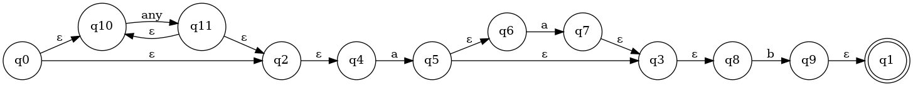
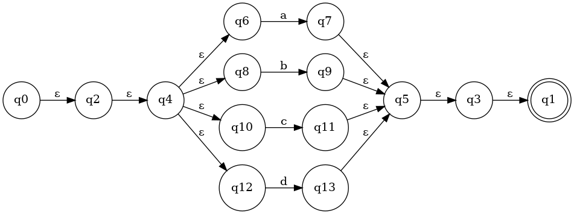

# regex
A regex engine built with C for recreational programming purposes.


# Note
<pre>regex is still under construction, bugs may appear from nowhere</pre>

# Expectations
This project is expected to reach a state where it can operate on regular expressions and test string matching.

# Now
regex is able to lex, parse, compile regular expressions into <a href="https://en.wikipedia.org/wiki/Nondeterministic_finite_automaton">NFAs</a> and use <a href="https://graphviz.org/">graphviz</a> for automaton visualization.
it can also check if a string matches a regex or not.

# Examples
```regex: "a+b"```



```regex: "^a+b$"```



```regex: "^a|b$"```



```regex: "a{1,2}b$"```



```regex: "^[a-d]$"```


